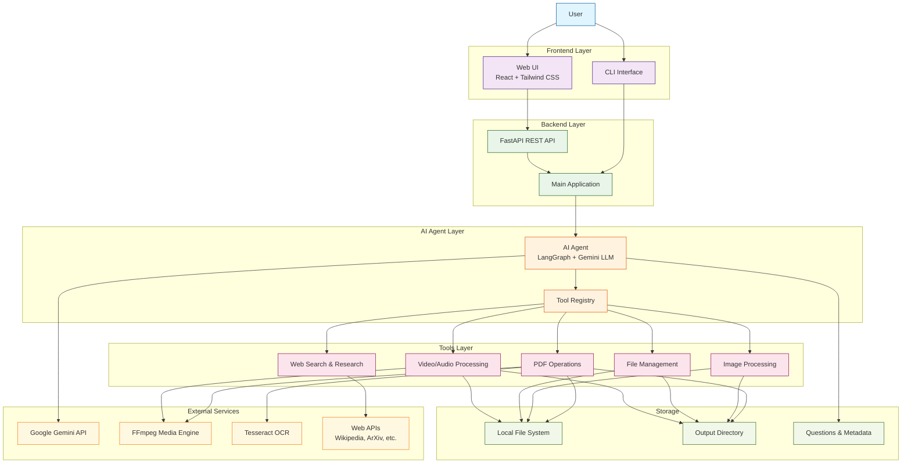

# DeskGenie High-Level Architecture Diagram

## System Overview

DeskGenie is an AI-powered desktop agent that enables users to perform file operations, document manipulation, and media processing through natural language commands.

## High-Level Architecture

## Component Descriptions

### Frontend Layer
- **Web UI**: React-based web interface for interactive chat with the AI agent
- **CLI Interface**: Command-line interface for direct interaction and batch processing

### Backend Layer
- **FastAPI REST API**: Handles HTTP requests from web UI, manages task execution
- **Main Application**: Orchestrates the overall application flow and configuration

### AI Agent Layer
- **AI Agent**: LangGraph-based agent powered by Google Gemini LLM for natural language understanding and reasoning
- **Tool Registry**: Manages and provides access to all available tools

### Tools Layer
- **PDF Operations**: Extract, delete, merge, split PDFs and convert to images
- **Image Processing**: Convert formats (HEIC, PNG, JPG, etc.), resize, compress images
- **File Management**: Batch rename, organize files, find duplicates
- **Video/Audio Processing**: Extract audio, compress video, get media info
- **Web Search & Research**: Web search, Wikipedia, ArXiv, YouTube analysis

### External Services
- **Google Gemini API**: Primary LLM provider for natural language processing
- **FFmpeg Media Engine**: Handles video and audio processing
- **Tesseract OCR**: Optical character recognition for text extraction from images
- **Web APIs**: External APIs for web search and knowledge retrieval

### Storage
- **Local File System**: Direct access to user's files and directories
- **Output Directory**: Default location for generated files (~/Desktop_Agent_Output)
- **Questions & Metadata**: Benchmark questions and execution metadata

## Data Flow

1. **User Request**: User sends command via Web UI or CLI
2. **API Processing**: Backend receives and validates the request
3. **Agent Execution**: AI agent analyzes the request and plans tool usage
4. **Tool Execution**: Agent executes appropriate tools to perform the task
5. **File Operations**: Tools interact with file system and external services
6. **Result Return**: Formatted results are returned to user with logging

## Key Capabilities

- **Natural Language Interface**: Understand and execute natural language commands
- **Multi-Format Support**: Handle PDFs, images, videos, documents, and more
- **Desktop Integration**: Direct access to local file system
- **Extensible Architecture**: Easy to add new tools and capabilities
- **Real-Time Feedback**: Live log streaming for operation monitoring
- **Benchmark Testing**: Built-in GAIA benchmark support for evaluation

## Technology Stack

- **Frontend**: React, Tailwind CSS, Vite
- **Backend**: FastAPI, Python 3.10+
- **AI**: LangGraph, Google Gemini API
- **Media**: FFmpeg, Pillow, Tesseract OCR
- **Development**: Python, Node.js